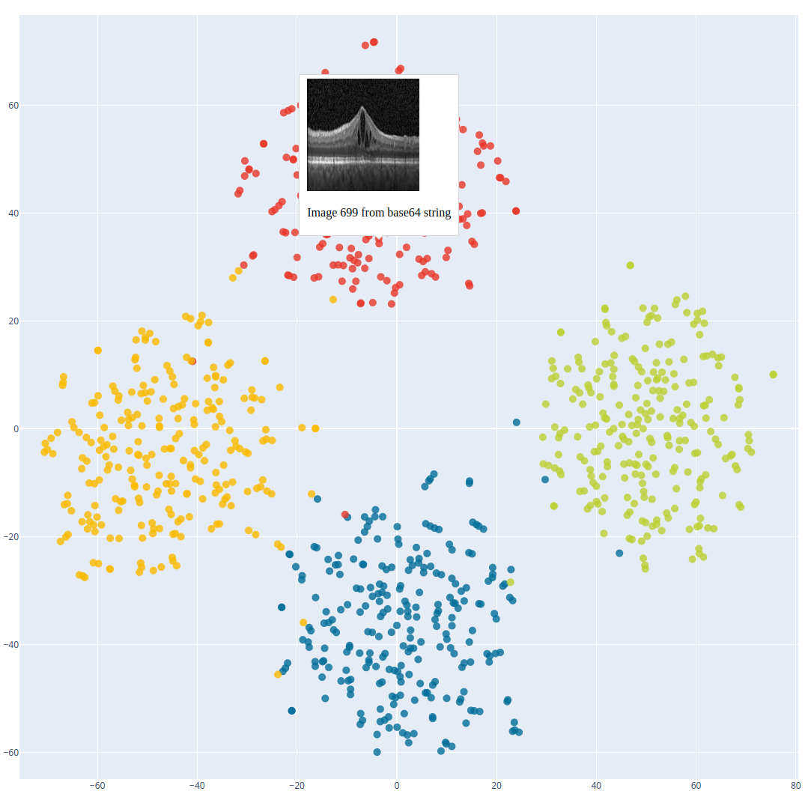

# Interactive Dash Downprojection Map

This repository provides an interactive Dash-based tool to explore the downprojected latent space of images. It includes two main scripts, `map_pca.py` and `map_tsne.py`, which allow you to locally run an interactive instance of Dash. When running either of these scripts, you can traverse the downprojected latent space and gain insights into the underlying data distribution.

## Usage

To use this tool, follow these steps:

```bash
# Clone this repository to your local machine:
git clone https://github.com/marceljhuber/Dash-Downprojection-Viewer

# Navigate to the project directory:
cd interactive-dash-downprojection

# Download the required images and w vectors from Hugging Face:
# You can download the necessary data from the following Hugging Face repository:
# Marcel Huber's Hugging Face Repository: https://huggingface.co/datasets/marcelhuber/downprojection_images
# Make sure to download the images and w vectors and place them in the appropriate directories within this project.

# Run the desired script to start the local Dash instance:
# To use PCA-based downprojection, run:
python map_pca.py

# To use t-SNE-based downprojection, run:
python map_tsne.py
```


